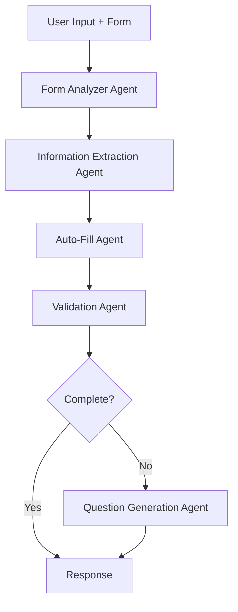

# Agentic AI Form Filling System

A sophisticated multi-agent system for intelligent form processing and auto-completion using LangGraph, LangChain, and FastAPI.

## 🎯 Overview

This agentic AI system transforms traditional form filling into an intelligent, conversational experience. It uses multiple specialized agents working together to understand, analyze, and complete forms based on natural language input.

## 🏗️ Architecture

### Multi-Agent Workflow



### Core Agents

1. **Form Analyzer Agent** 📊
   - Analyzes form structure and field requirements
   - Identifies mandatory vs optional fields
   - Maps field dependencies
   - Calculates completion percentage

2. **Information Extraction Agent** 🔍
   - Extracts relevant information from user messages
   - Uses NLP to identify entities and values
   - Maps extracted data to appropriate form fields
   - Handles context and implied information

3. **Auto-Fill Agent** ✍️
   - Intelligently populates form fields
   - Applies business logic and field dependencies
   - Makes smart suggestions based on context
   - Ensures data consistency across related fields

4. **Validation Agent** ✅
   - Validates form data against business rules
   - Checks field formats and constraints
   - Identifies missing required information
   - Detects validation errors

5. **Question Generation Agent** ❓
   - Generates clarifying questions for missing data
   - Creates context-aware prompts
   - Provides helpful suggestions
   - Guides users through form completion

## 🚀 Features

- **Intelligent Auto-Completion**: Automatically fills form fields based on natural language input
- **Context-Aware Processing**: Understands business logic and field relationships
- **Smart Validation**: Comprehensive validation with helpful error messages
- **Conversational Interface**: Asks clarifying questions when information is missing
- **Confidence Scoring**: Provides confidence levels for auto-filled data
- **Multi-Step Workflow**: Processes forms through multiple validation stages
- **RESTful API**: Easy integration with existing applications

## 📋 Supported Form Field Types

- `text` - Single line text input
- `textarea` - Multi-line text input
- `radio` - Radio button selection
- `select-one` - Dropdown selection
- `checkbox` - Checkbox input
- `email` - Email address validation
- `number` - Numeric input
- `date` - Date picker

## 🔧 API Endpoints

### POST `/agenticai/fill-form`

Main endpoint for intelligent form filling.

**Request Body:**
```json
{
  "message": "Can you help me fill this form? I work for the federal government.",
  "form_fields": [
    {
      "data_id": "V1FeeExemptionCategory",
      "field_label": "*Fee Exemption Category:",
      "field_type": "select-one",
      "field_value": "",
      "is_required": true,
      "options": ["Federal Government", "Provincial Government", "Municipal Government"]
    }
  ],
  "user_context": {
    "organization_type": "government"
  }
}
```

**Response:**
```json
{
  "status": "needs_info",
  "result": {
    "filled_fields": {
      "V1FeeExemptionCategory": "Federal Government"
    },
    "missing_information": ["V1FeeExemptionClientNumber"],
    "questions_for_user": ["What is your client number for the fee exemption program?"],
    "suggestions": ["Since you're eligible for fee exemption, you'll need to provide your client number."],
    "confidence_score": 0.75
  },
  "workflow_state": "complete",
  "next_action": "Please provide the requested information to complete the form"
}
```

### GET `/agenticai/example-form`

Returns an example form structure for testing.

### GET `/agenticai/workflow-info`

Returns detailed information about the workflow and agents.

### POST `/agenticai/validate-form`

Validation-only endpoint for form checking without auto-filling.

## 🛠️ Usage Examples

### Example 1: Water License Application

```python
import httpx

# Example form filling request
request_data = {
    "message": "I need help with my water license application. I work for the federal government and am eligible for fee exemption.",
    "form_fields": [
        {
            "data_id": "V1IsEligibleForFeeExemption",
            "field_label": "Are you eligible for fee exemption?",
            "field_type": "radio",
            "field_value": "",
            "is_required": True,
            "options": ["Yes", "No"]
        },
        {
            "data_id": "V1FeeExemptionCategory",
            "field_label": "*Fee Exemption Category:",
            "field_type": "select-one", 
            "field_value": "",
            "is_required": True,
            "options": ["Federal Government", "Provincial Government"]
        }
    ]
}

# Call the API
response = httpx.post("http://localhost:8000/agenticai/fill-form", json=request_data)
result = response.json()
```

### Example 2: Form Validation Only

```python
# Validate existing form data
validation_request = {
    "message": "Please validate my form",
    "form_fields": [
        {
            "data_id": "V1FeeExemptionClientNumber",
            "field_label": "*Client Number:",
            "field_type": "text",
            "field_value": "ABC", # Too short
            "is_required": True
        }
    ]
}

response = httpx.post("http://localhost:8000/agenticai/validate-form", json=validation_request)
```

## 🧪 Testing

Run the test suite to see the system in action:

```bash
cd app
python test_agentic_ai.py
```

This will demonstrate:
- Full agentic workflow processing
- Form validation capabilities
- Individual tool functionality

## 🔧 Configuration

The system uses environment variables for configuration:

```bash
OPENAI_API_KEY=your_openai_api_key
LOG_LEVEL=INFO
```

## 📁 Project Structure

```
app/agenticai/
├── __init__.py
├── models/
│   └── __init__.py          # Pydantic models and schemas
├── agents/
│   └── __init__.py          # Individual agent implementations
├── tools/
│   └── __init__.py          # Utility tools for form processing
├── workflows/
│   └── __init__.py          # LangGraph workflow orchestration
└── endpoints/
    └── __init__.py          # FastAPI endpoint definitions
```

## 🚀 Getting Started

1. **Install Dependencies**
   ```bash
   uv sync
   ```

2. **Set Environment Variables**
   ```bash
   export OPENAI_API_KEY="your-api-key"
   ```

3. **Start the Server**
   ```bash
   uvicorn app.main:app --reload
   ```

4. **Test the API**
   ```bash
   curl -X POST "http://localhost:8000/agenticai/fill-form" \
     -H "Content-Type: application/json" \
     -d @example_request.json
   ```

5. **View API Documentation**
   Visit `http://localhost:8000/docs` for interactive API documentation.

## 🎯 Use Cases

- **Government Forms**: License applications, permit requests, regulatory filings
- **Insurance Applications**: Claims processing, policy applications
- **HR Systems**: Employee onboarding, benefits enrollment
- **Customer Onboarding**: Account setup, KYC processes
- **Survey Systems**: Smart questionnaire completion

## 🔮 Future Enhancements

- **Multi-language Support**: Process forms in multiple languages
- **Document Upload**: Extract information from uploaded documents
- **Voice Integration**: Voice-to-form filling capabilities
- **Machine Learning**: Improve auto-fill accuracy with usage data
- **Custom Business Rules**: Configurable validation and logic rules
- **Integration Connectors**: Pre-built connectors for popular form platforms

## 📝 Contributing

1. Fork the repository
2. Create a feature branch
3. Make your changes
4. Add tests for new functionality
5. Submit a pull request

## 📄 License

This project is licensed under the MIT License - see the LICENSE file for details.

---

**Built with ❤️ using FastAPI, LangGraph, and LangChain**
